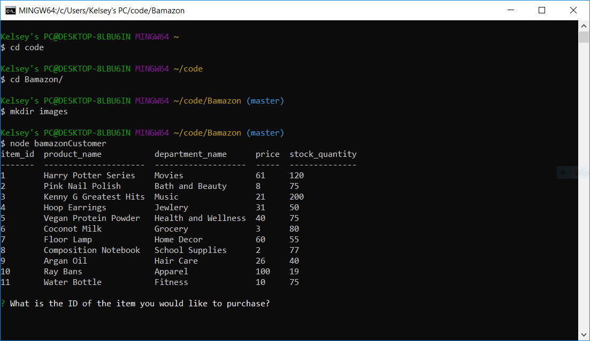
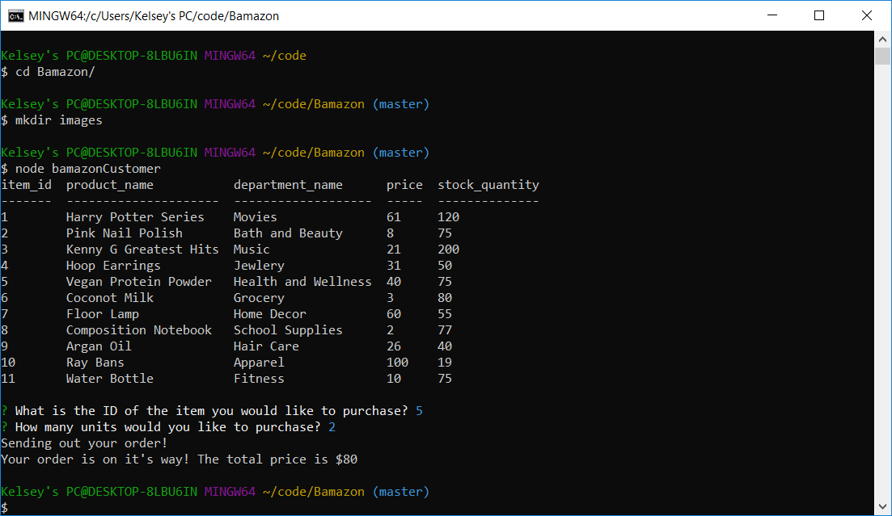
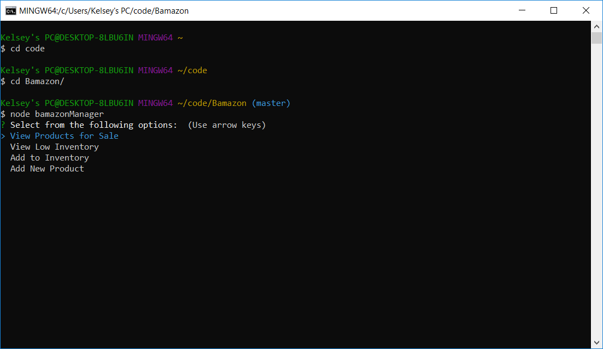
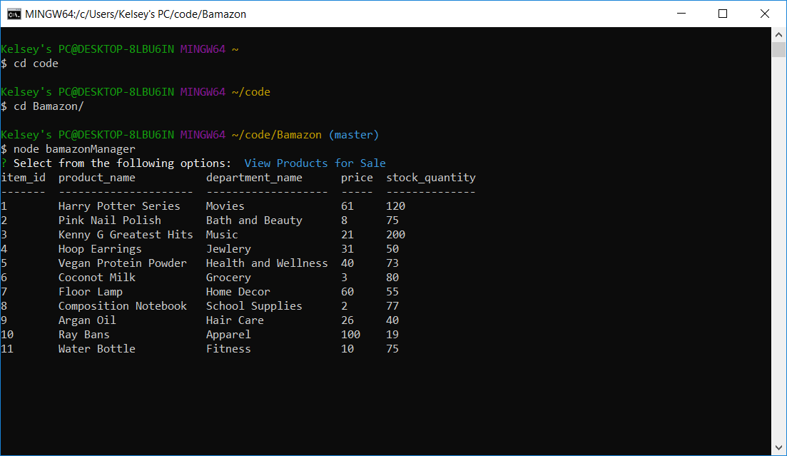
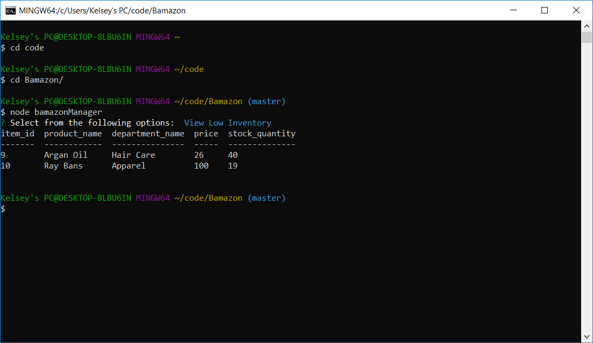
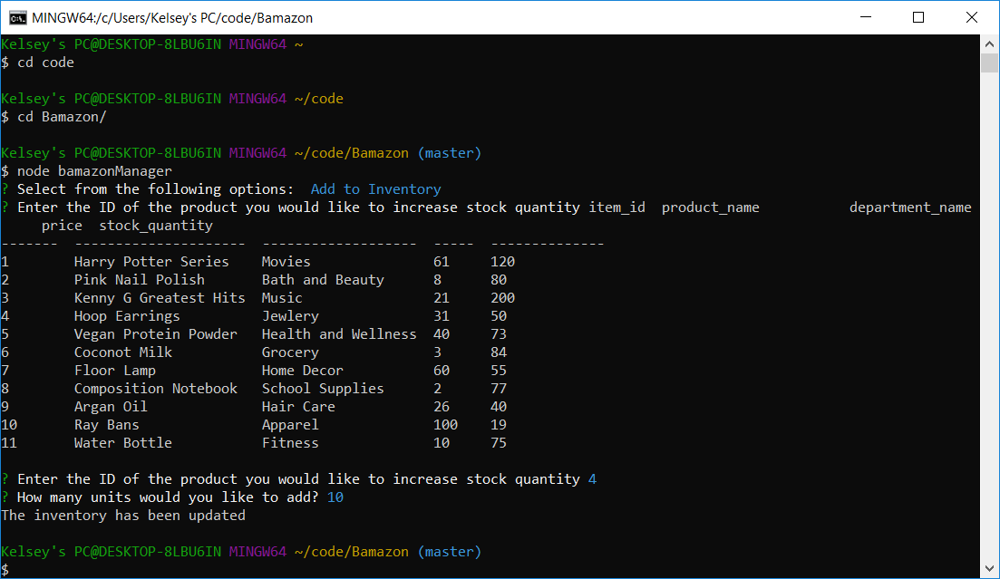
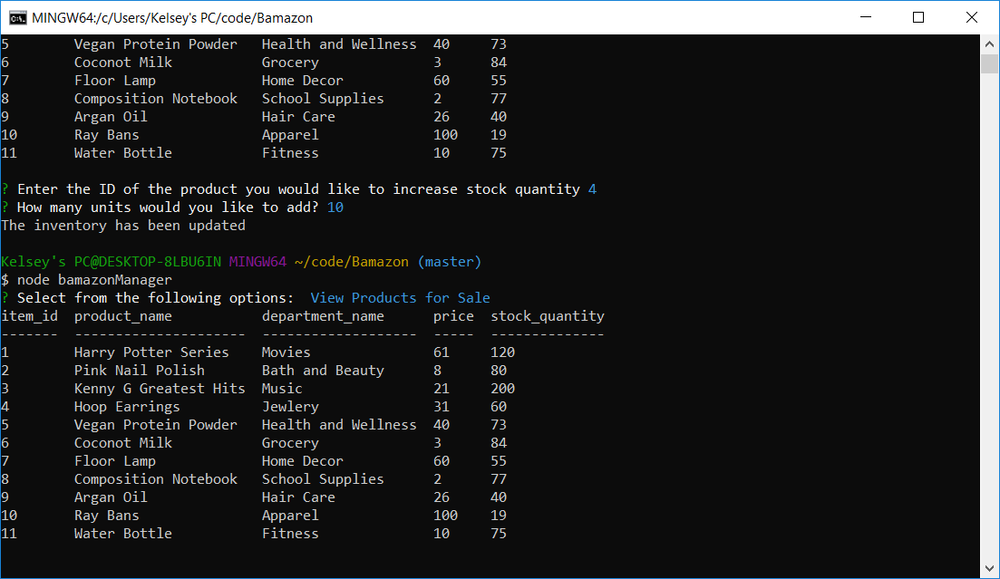
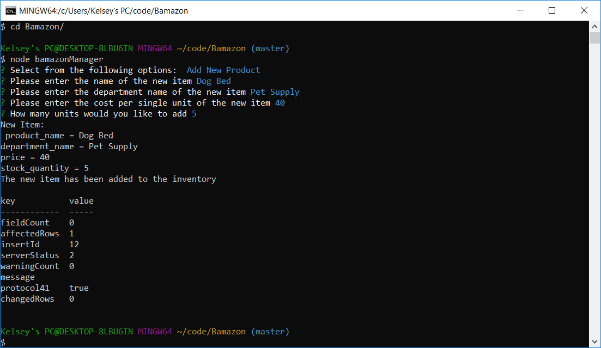
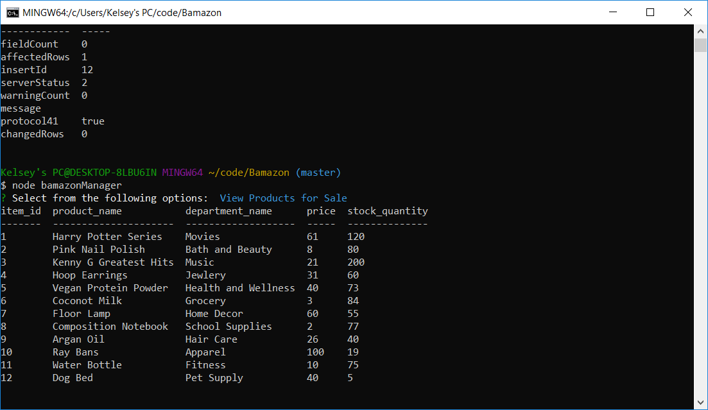

# Bamazon
**CLI Node and MySql Application**

## Introduction
Bamazon is a command line application focused on connecting to and querying a local MySql database for different user input related commands. Bamazon uses Node and the Inquirere package to take in user parameters and return the requested data or perform requested updates to the MySql database.

There are two parts, the Bamazon Customer Interface and the Bamazon Manager Interface - each rendering varying functionality based on user input. 

### Bamazon Customer
User will run the command **node bamazonCustomer** and a table displaying the items available will be logged to command line. They will be prompted to enter the value of the item id and the quantity they would like to purchase.

After entering the required information, if there is enough stock available the purchase will go through and the user will be updated of the total cost.

The user will then run **node bamazonCustomer** again to view the updated stock quantity value.

### Bamazon Manager
User will run the command **node bamazonManager** and a list of options will display to the console. The user will select which option they would like to run and proceed through the prompted steps

#### Manager Task Options List

#### Manager View Inventory

#### Manager View Low Inventory

#### Manager Add to Inventory

#### Manager Add New Product

##### Packages
**1.NPM Packages Used**
    
    Inquirer

    MySql

    cTable

**To install these packages run the following commands in your terminal**
    
    npm install inquirer

    npm install mysql

    npm install console.table

    

